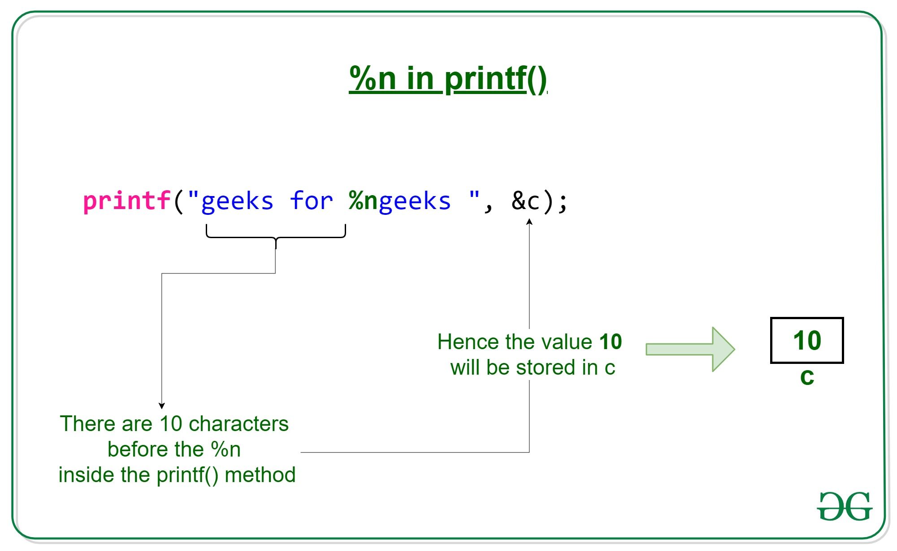

# Project Name: Custom printf Function

## Table of Contents
- [Description](#description)
- [Usage](#usage)
- [Supported Conversion Specifiers](#supported-conversion-specifiers)
- [Custom Conversion Specifiers](#custom-conversion-specifiers)
- [Repository](#repository)
- [License](#license)

---

## Description

This project is an implementation of a custom `printf` function in C. The function, named `_printf`, emulates the behavior of the standard C library `printf` with support for various format specifiers. The primary goal is to produce output according to a specified format and write it to the standard output stream (`stdout`).

The `_printf` function supports a subset of the format specifiers provided by the standard `printf` function. It also includes custom conversion specifiers for additional functionality. The function is designed to return the number of characters printed, excluding the null byte used to terminate output to strings.

Please note that this implementation does not handle various formatting options like flag characters, field width, precision, or length modifiers. It focuses on the basic functionality of formatting and printing data.

## Usage

To use the custom `printf` function in your C program, follow these steps:

1. Include the `printf.h` header file in your source code.

   ```c
   #include "printf.h"
   ```

2. Call the `_printf` function with the desired format and arguments. For example:

   ```c
   int chars_printed = _printf("Hello, %s! Your score is %d.\n", "Alice", 85);
   ```

3. The function will print the formatted output to the standard output stream (`stdout`) and return the number of characters printed.

4. Make sure to link your program with the `printf` library.

### Example:

```c
#include "printf.h"

int main() {
    int score = 85;
    int chars_printed = _printf("Hello, %s! Your score is %d.\n", "Alice", score);
    return 0;
}
```

## Supported Conversion Specifiers

The `_printf` function supports the following standard conversion specifiers:

- `%c`: Character
- `%s`: String
- `%%`: Percentage sign
- `%d` or `%i`: Signed integer

It also supports the following non-standard conversion specifiers:

- `%u`: Unsigned integer
- `%o`: Octal representation
- `%x`: Hexadecimal representation (lowercase)
- `%X`: Hexadecimal representation (uppercase)
- `%p`: Pointer address

## Custom Conversion Specifiers

In addition to the standard conversion specifiers, the `_printf` function supports several custom conversion specifiers:

- `%b`: Binary representation of an unsigned integer
- `%S`: String with non-printable characters escaped as `\xXX` (hexadecimal ASCII code)
- `%r`: Reversed string
- `%R`: Rot13-encoded string

## Repository

You can find the source code for this project in the following GitHub repository:

- [GitHub Repository: printf](https://github.com/hima890/printf)

Please feel free to clone, fork, or contribute to the repository as needed.

## License

This project is provided under the open-source [MIT License](LICENSE). You are free to use, modify, and distribute it in accordance with the terms of the license.

---

## By
IBRAHIM HANAFI
AHMED BASHER
